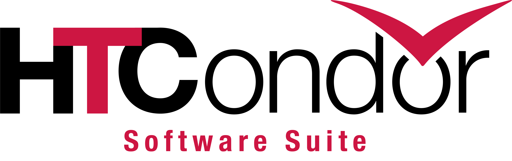

<!-- Page body -->
<h1 class="norm">HTCondor Logos</h1>

The official HTCondor logo comes in two varieties as shown below, one including the 
"High Throughput Computing" tag-line and one without the tag-line.  The logo
is also 
<a href="htcondor_logos/">
available in a variety of file formats and coloring situations</a>.

If you want to match the logo (say, to create an HTCondor Week logo),
this is roughly how the logo was created.  This is a reconstruction, not
the original work:
<ul>
<li>HTC - Helvetica Neue Bold, -16% letter spacing. T is set in red and the
crossbar extended.
<li>ondor - Helvetica Neue Light, -3.3% letter spacing
<li>Artificially extend crossbar of the T
</ul>

Helvetica Neue Bold and Light are available on modern Mac OS X
computers.  It's not usually present on Windows or Linux.

<a href="htcondor_logos/PNG/HTCondor_red_blk.png">

 

</a>

<a href="htcondor_logos/PNG/HTCondor_red_blk_notag.png">

 

</a>
